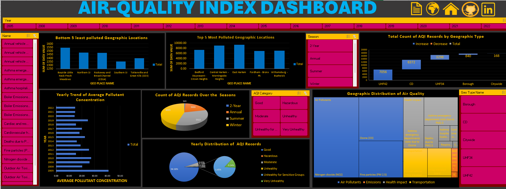

# 🌫️ Air Quality Index Dashboard

This repository contains an interactive **Air Quality Index (AQI) Dashboard** developed using real-time or historical government data. It tracks and visualizes air pollution metrics to support environmental awareness and help users make informed decisions based on AQI trends and health implications.

---

## 📌 Project Overview

- **Project Title:** Air Quality Index Dashboard  
- **Domain:** Environmental Data Analytics  
- **Objective:** Visualize air quality metrics using a dynamic dashboard that simplifies AQI data into meaningful insights.  
- **Tools Used:** Excel (Dynamic Buttons, Charts, Dashboard), Python (Data Cleaning), Data Wrangling, Visualization Techniques.

---

## 📈 Features

- 📊 Interactive Dashboard with charts for PM2.5, PM10, NO₂, CO, SO₂, O₃  
- 🌍 Region-wise AQI and Emergency Visit Comparison (e.g., East Harlem vs. Bayside)  
- 🗓️ Monthly & Seasonal Trends Visualization (e.g., spikes in winter, cleaner summers)  
- ⚙️ Filter-based analysis with slicers for pollutant type, year, season, and area  
- 🧠 Health Data Correlation (Asthma-related emergencies by location and pollutant)  
- 🔍 Insight-driven formatting to identify danger zones and alerts  

---

## 🔧 Technologies Used

| Tool             | Purpose                                                |
|------------------|--------------------------------------------------------|
| **Excel**        | Data cleaning, dashboard design, visualization         |
| **Python (Pandas)** | Preprocessing & filtering data before Excel use     |
| **Charts & Pivot Tables** | Line, Bar, Pie, Treemap charts; data summarization |
| **Slicers & Conditional Formatting** | Dynamic filtering, highlighting risk zones |

---

## 📂 Files Included

| File Name                         | Description                                                      |
|----------------------------------|------------------------------------------------------------------|
| `AIRQUALITYDASHBOARDFINAL.xlsx`  | Final version of the AQI dashboard with pivot tables, slicers, and visual insights |

---

## 📸 Preview

### Dashboard 

---

## 📊 Key Analysis & Insights

- **Pollution Hotspots:** East & Central Harlem show highest asthma emergencies  
- **Safe Zones Identified:** Areas like Bayside and Upper East Side have significantly fewer incidents  
- **Seasonal Effects:** Notable AQI spikes during winter; cleaner air in spring/summer  
- **Pollutant Ranking:** NO₂ is the highest contributor followed by PM2.5 and O₃  
- **Health Impact:** Direct correlation between emergency visits and pollutant levels (Ozone, NO₂, PM2.5)  
- **AQI Distribution:** Most records fall under ‘Good’ (47.14%) and ‘Moderate’ (27.86%), with fewer ‘Unhealthy’ entries  

---

## 🚀 How to Use

1. Download and open the `.xlsx` file in Microsoft Excel.  
2. Navigate through dashboard tabs to explore AQI metrics, seasonal patterns, and emergency hotspots.  
3. Use filters to explore data by:  
   - **Pollutant Type**  
   - **Date/Season**  
   - **Region**  
4. Interpret data via visualizations: pie charts, bar graphs, treemaps, stacked bars, and more.

---
## 📚 References

- **Dataset Sources:**  
  - [NYC Open Data – Air Quality Dataset](https://data.cityofnewyork.us/api/views/c3uy-2p5r/rows.csv?accessType=DOWNLOAD)  
  - [Data.gov](https://data.gov)  
  - EPA AQI Standards and WHO Air Quality Guidelines  

- **Tools & Technologies:**  
  - Microsoft Excel – Pivot Tables, Conditional Formatting, Slicers  
  - Python – Data Cleaning using Pandas & NumPy  
  - Visualization – Bar, Pie, Treemap, and Stacked Charts  

---

## 🙋‍♀️ About the Author

Hi! I'm **Anchal Shukla**, an aspiring data scientist passionate about building solutions that matter. I enjoy visualizing meaningful patterns from data and transforming spreadsheets into powerful dashboards.

- 💼 [LinkedIn](https://www.linkedin.com/in/anchal-shukla-360748289/)  
- 📫 [Email](mailto:anayshukla2015@gmail.com)  
- 🐙 [GitHub](https://github.com/Anchalshukla145)

> _“Without data, you’re just another person with an opinion.” – W. Edwards Deming_
